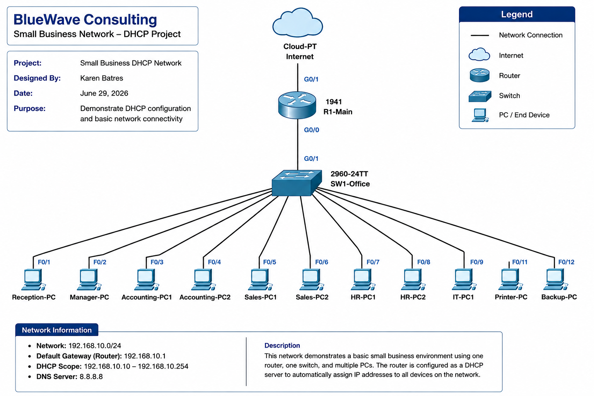
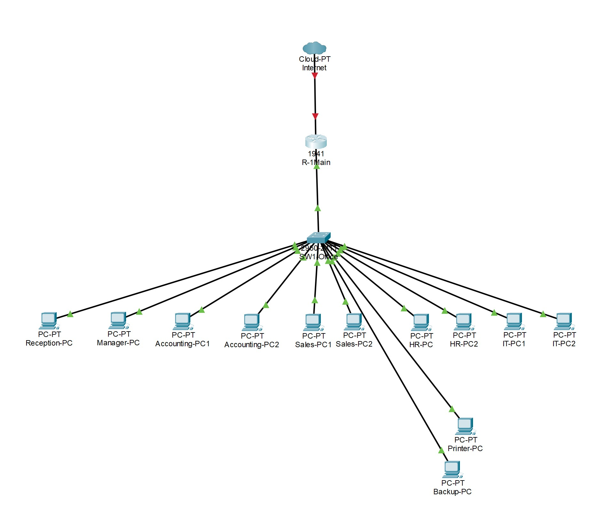
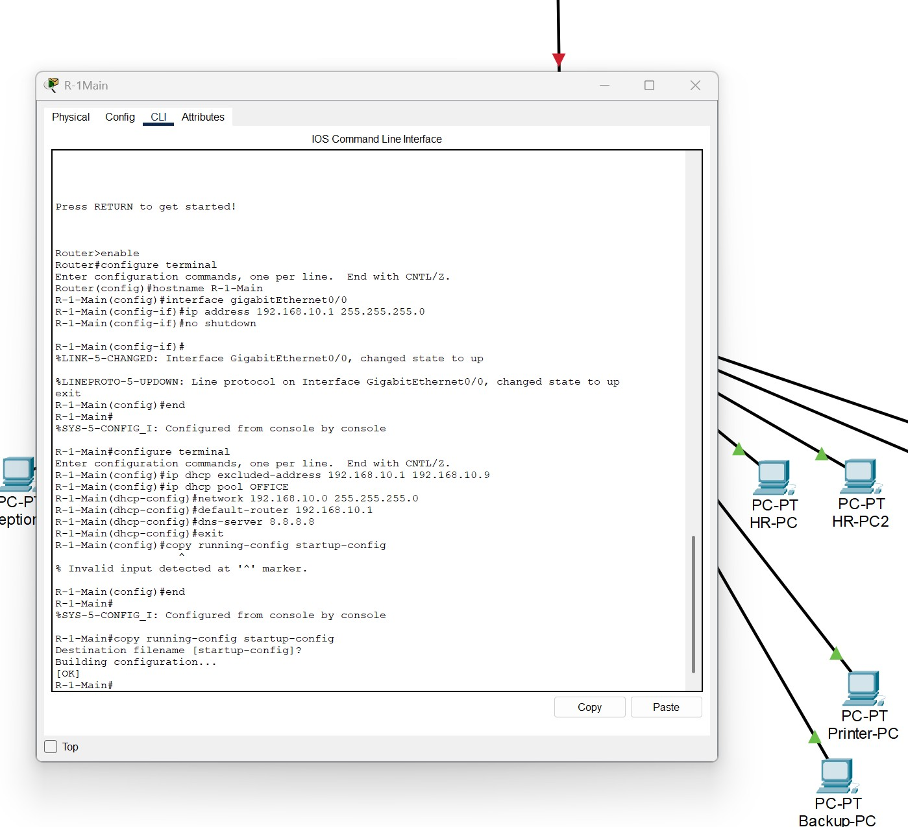
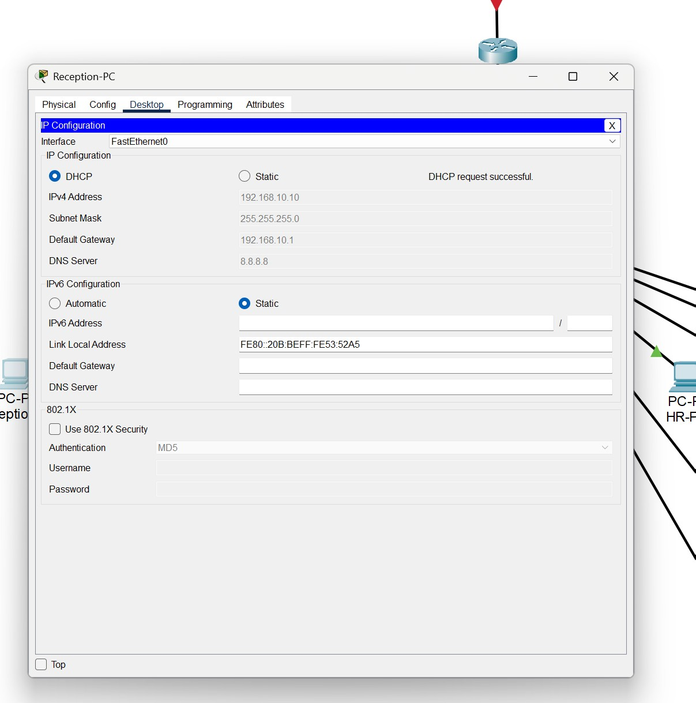
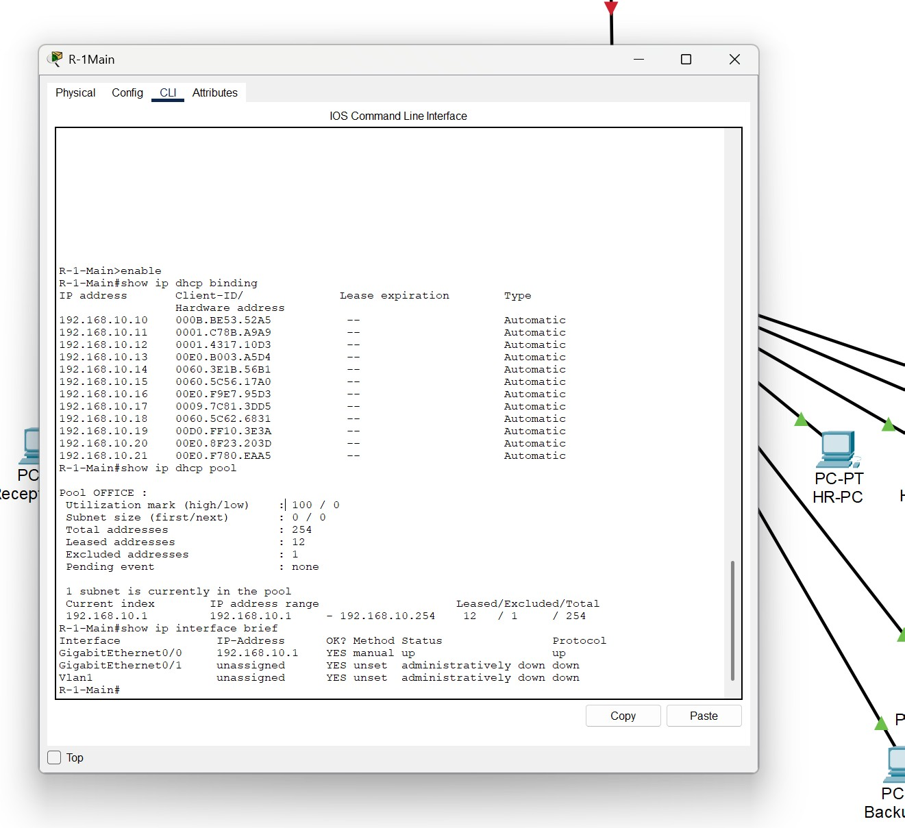
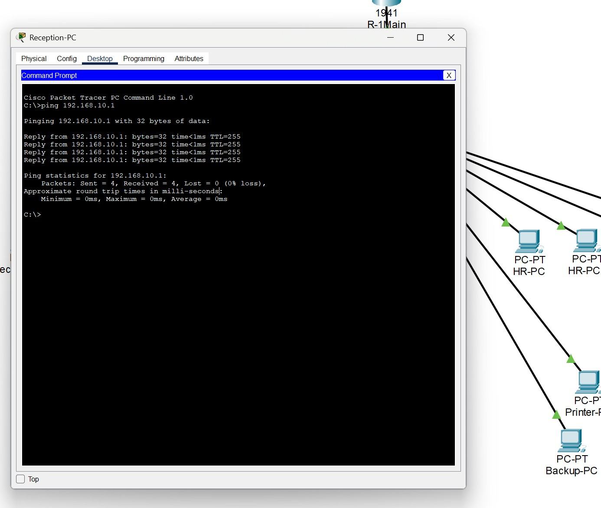
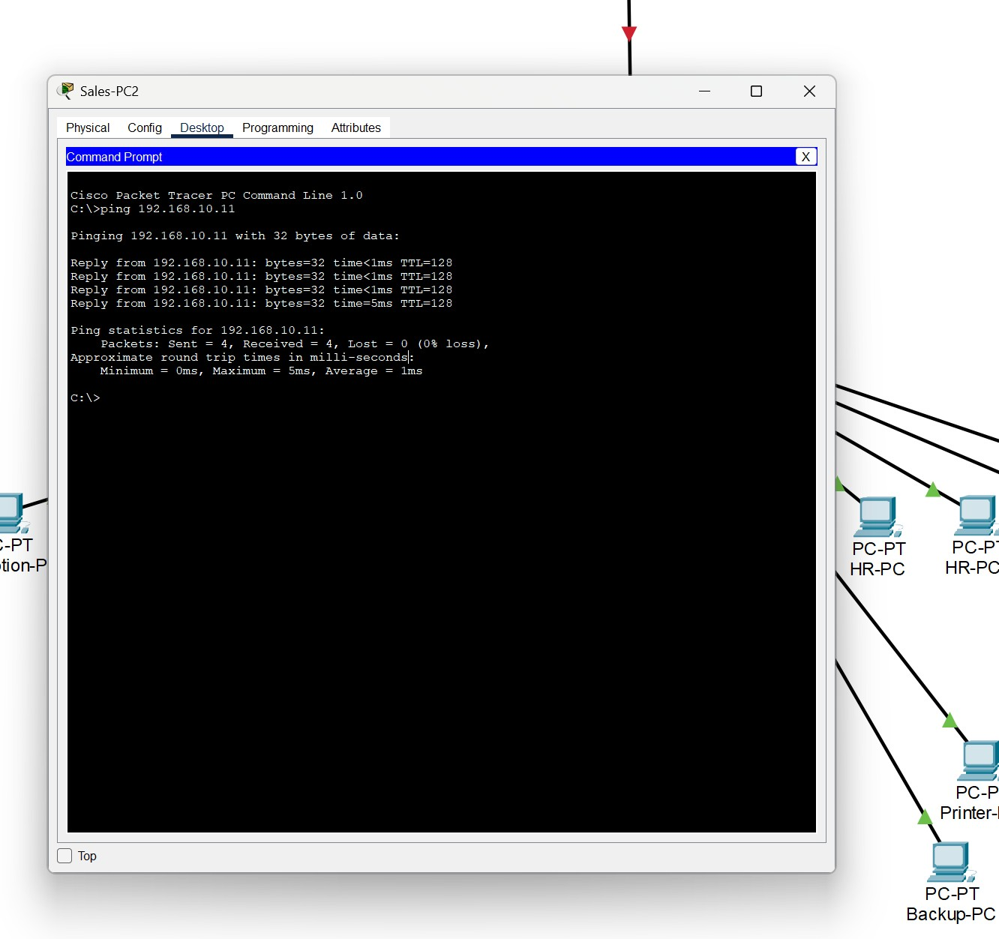

# 🖧 Small Business DHCP Network
### Cisco Packet Tracer | Cisco IOS | DHCP | IPv4 Networking

---

# 📌 Project Overview



This project demonstrates the design, configuration, and verification of a **Small Business Local Area Network (LAN)** using **Cisco Packet Tracer**.

The network simulates a small office environment consisting of one Cisco 1941 router, one Cisco 2960 switch, an Internet cloud for topology representation, and twelve client computers representing multiple business departments.

The Cisco router was configured as a **DHCP server**, allowing all client devices to automatically obtain IPv4 addresses instead of requiring manual static IP configuration.

This project was completed as part of my hands-on networking practice while preparing for the **Bachelor of Science in Cybersecurity and Information Assurance at Western Governors University (WGU)** and the **CompTIA Network+ certification**.

---

# 📑 Table of Contents

- Project Overview
- Project Objectives
- Business Scenario
- Network Topology
- Devices Used
- Network Information
- Router Configuration
- DHCP Client Configuration
- Network Verification
- Connectivity Testing
- Skills Demonstrated
- What I Learned
- Repository Contents
- Future Improvements
- Author

---

# 🎯 Project Objectives

The objectives of this project were to:

- Design a small business LAN.
- Configure a Cisco 1941 router.
- Configure the router as a DHCP server.
- Automatically assign IPv4 addresses to client devices.
- Verify DHCP operation.
- Test end-to-end network connectivity.
- Document the project professionally using GitHub.

---

# 🏢 Business Scenario

**Company:** BlueWave Consulting

BlueWave Consulting is a small business with twelve employees distributed across multiple departments.

Departments included in this project:

- Reception
- Management
- Accounting
- Sales
- Human Resources
- IT
- Shared Devices

The goal was to build a functional office network where all computers automatically receive their IP configuration through DHCP.

---

# 🌐 Network Topology



---

# 🖥️ Devices Used

| Device | Quantity |
|---------|---------:|
| Cisco 1941 Router | 1 |
| Cisco 2960-24TT Switch | 1 |
| Cloud-PT (Internet) | 1 |
| Desktop PCs | 12 |

---

# 🌍 Network Information

| Configuration | Value |
|--------------|-------|
| Network Address | 192.168.10.0/24 |
| Router IP Address | 192.168.10.1 |
| Default Gateway | 192.168.10.1 |
| DHCP Scope | 192.168.10.10 – 192.168.10.254 |
| DNS Server | 8.8.8.8 |

---

# ⚙️ Router Configuration

The Cisco 1941 router was configured to:

- Configure the router hostname.
- Configure the GigabitEthernet interface.
- Assign the LAN IP address.
- Configure DHCP excluded addresses.
- Create a DHCP address pool.
- Configure the default gateway.
- Configure the DNS server.
- Save the running configuration.

### Router Configuration



---

# 💻 DHCP Client Configuration

Each client computer was configured to automatically obtain its IP address using DHCP.

Every workstation successfully received:

- IP Address
- Subnet Mask
- Default Gateway
- DNS Server



---

# ✅ Network Verification

The following Cisco IOS commands were used to verify the network:

```text
show ip interface brief
show ip dhcp pool
show ip dhcp binding
```

These commands verified:

- Router interface status
- DHCP address pool
- Active DHCP leases
- Interface operational status



---

# 📡 Connectivity Testing

## Ping Test to the Router

The client computer successfully communicated with the default gateway.



---

## PC-to-PC Communication

All client computers successfully communicated with each other after receiving their DHCP configuration.



---

# 🧠 Skills Demonstrated

Through this project I practiced:

- Cisco Packet Tracer
- Cisco IOS CLI
- Router Configuration
- DHCP Configuration
- IPv4 Addressing
- LAN Design
- Switch Connectivity
- Network Verification
- Ping Testing
- Basic Troubleshooting
- Technical Documentation
- GitHub Portfolio Development

---

# 📚 What I Learned

This project helped me gain practical experience designing and configuring a small business network.

Key concepts I learned include:

- Designing and documenting a LAN topology.
- Configuring a Cisco router using the Cisco IOS Command-Line Interface.
- Configuring a Cisco router as a DHCP server.
- Understanding how DHCP automatically assigns IP addresses to clients.
- Configuring client computers to obtain IP addresses dynamically.
- Verifying DHCP leases and router interfaces using Cisco verification commands.
- Testing connectivity with the `ping` command.
- Strengthening my understanding of IPv4 addressing, subnet masks, default gateways, and DNS configuration.
- Practicing basic network troubleshooting techniques.
- Improving my technical documentation skills using GitHub.

This project strengthened my understanding of networking concepts that are covered in Cisco networking courses, CompTIA Network+, and the WGU Cybersecurity and Information Assurance program.

---

# 📁 Repository Contents

```text
Small-Business-DHCP-Network/
│
├── README.md
├── Small-Business-DHCP-Network.pkt
├── 00-Project-Overview.png
├── 01-Small-Business-Topology.jpg
├── 02-Router-DHCP-Configuration.jpg
├── 03-PC-DHCP-Configuration.jpg
├── 04-Router-Verification-Commands.jpg
├── 05-Ping-Router-Success.jpg
└── 06-PC-to-PC-Success.jpg
```

---

# 🚀 Future Improvements

The next version of this project will include:

- VLAN Configuration
- Router-on-a-Stick
- Inter-VLAN Routing
- Multiple DHCP Scopes
- Access Control Lists (ACLs)
- Wireless Networking
- Basic Network Security

These enhancements will continue building my networking and cybersecurity skills through hands-on practice.

---

# 👩‍💻 Author

**Karen Batres**

Bachelor of Science in Cybersecurity and Information Assurance  
Western Governors University (WGU)

**GitHub:** https://github.com/KarenB1-tech

**LinkedIn:** *(Add your LinkedIn profile URL here.)*

---

⭐ **Thank you for reviewing my project! Feedback and suggestions are always welcome.**
